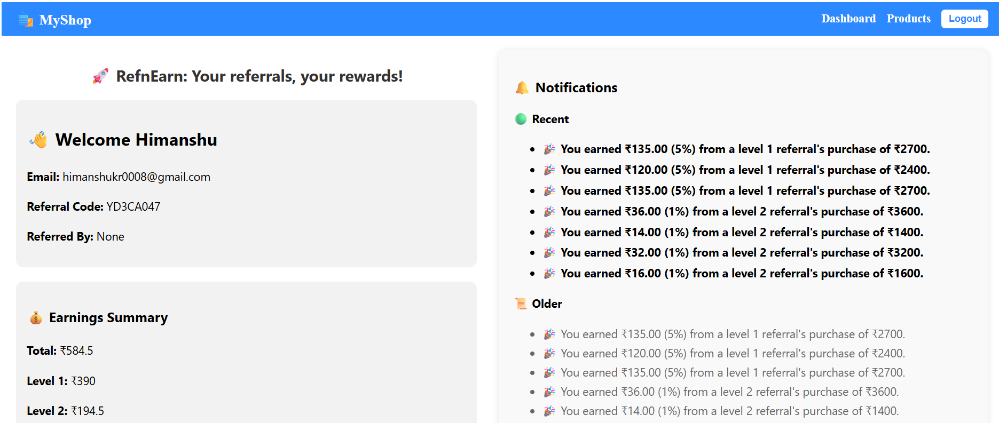
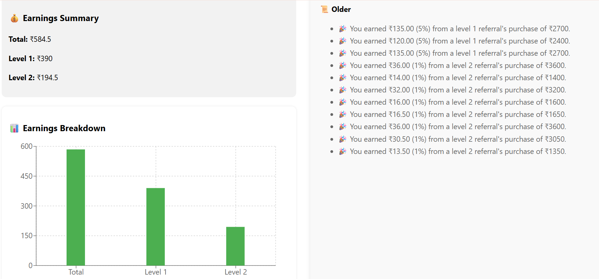
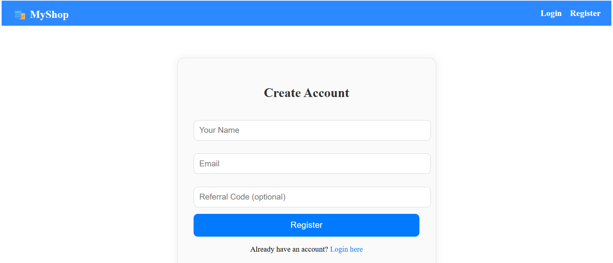

# 🛍️ RefnEarn — Multi-Level Referral & Profit Sharing E-Commerce System

RefnEarn is a full-stack **MERN** application that allows users to shop for products, refer others, and earn profits through a **two-level referral commission system**. The app features real-time **notifications** via **Socket.IO**, a responsive UI, and an intuitive user experience.
---
## Click here to try it out
🔗 **Live Demo:** https://multi-level-referral-and-earning-system-1.onrender.com
---

## ✅ Features

### 👤 User Management
- Register using a referral code (optional, limited to 8 direct referrals per user)
- Unique referral code generation on sign-up
- Login with email (no password for simplicity)

### 🛒 Shopping & Transactions
- Product listing with “Add to Cart”, increment/decrement quantity
- Place orders directly from cart
- Orders above ₹1000 trigger referral profit sharing

### 💸 Referral Profit Distribution
- **Level 1** (Direct Referrer): 5% of the transaction amount
- **Level 2** (Referrer’s Referrer): 1% of the transaction amount
- Earnings are stored in the backend database

### 🔔 Real-Time Notifications
- Users who earn from a transaction receive live notifications
- Notifications are categorized as:
  - **Recent** (via Socket.IO)
  - **Older** (fetched on dashboard load)
- Seamless user experience with live feedback

---

## 🧱 Tech Stack

| Layer          | Technology                  |
|----------------|-----------------------------|
| Frontend       | React (with Vite), Redux Toolkit |
| Backend        | Node.js, Express.js         |
| Database       | MongoDB (with Mongoose)     |
| Realtime Comm  | Socket.IO                   |
| Styling        | Custom CSS                  |

---

##   Frontend pages

### As it is for backend role so i was more focused on implementing the backend logics.







## 📦 Getting Started

### 🔧 Backend Setup

```bash
cd backend
npm install
```

Create a `.env` file in the backend directory:

```env
PORT=5000
MONGO_URI=your_mongodb_connection_string
```

Start the server:

```bash
node index.js
```

---

### 🎨 Frontend Setup

```bash
cd frontend
npm install
npm run dev
```

---

## 🔗 API Endpoints

| Method | Endpoint                        | Description                           |
|--------|----------------------------------|---------------------------------------|
| POST   | `/api/auth/register`            | Register a new user                   |
| POST   | `/api/auth/login`               | Login using email                     |
| GET    | `/api/earnings/:userId`         | Get earnings summary                  |
| POST   | `/api/transaction/purchase`     | Place an order (triggers earnings)    |
| GET    | `/api/notifications/:userId`    | Fetch old notifications               |

---

## 🔄 Referral Logic

```
User A → refers → User B
User B → refers → User C

If C places a ₹2000 order:
→ B earns ₹100 (5%)
→ A earns ₹20 (1%)
```

---

## 🧠 What I Learned

- Implementing real-time systems using **Socket.IO**
- Structuring reusable, scalable Express APIs
- Managing complex state via **Redux Toolkit**
- Building a **multi-level referral logic** system
- Integrating real-time + persistent notification systems

---

## 👨‍💻 Author

**Himanshu Kumar**  
 
📫 Email: [himanshukrdtu@gmail.com](mailto:himanshukrdtu@gmail.com)  
🔗 GitHub: [@himanshukrdtu](https://github.com/himanshukrdtu)

---

> 📝 Submitted as an assignment for a **Backend Development Role**  
> 🧪 For demo credentials or walkthrough, feel free to contact me!
